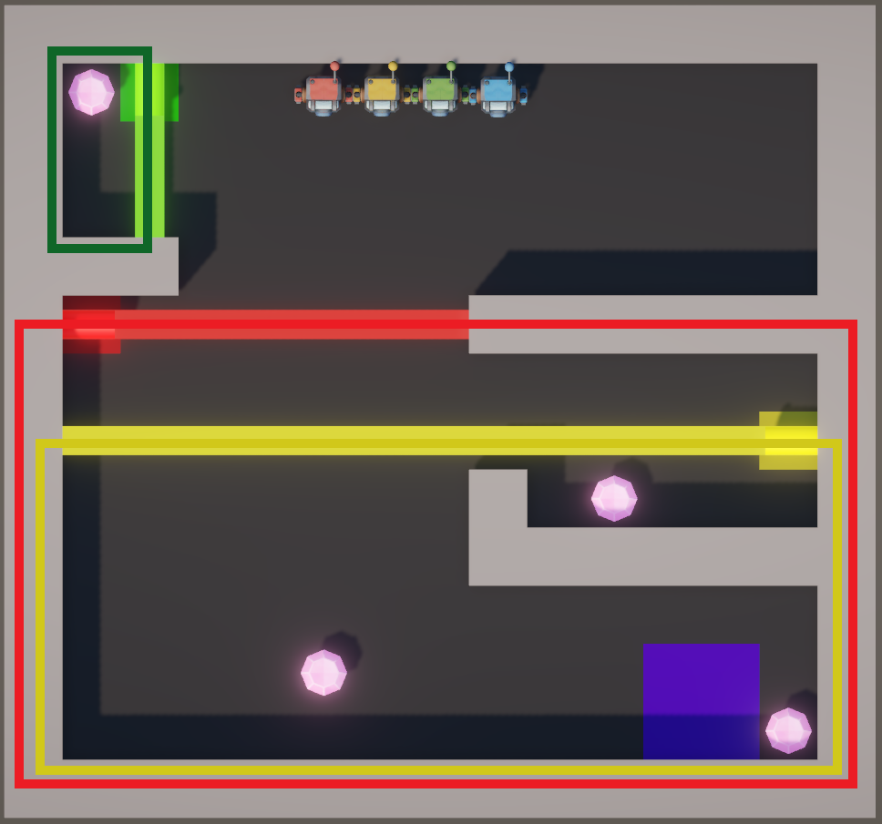
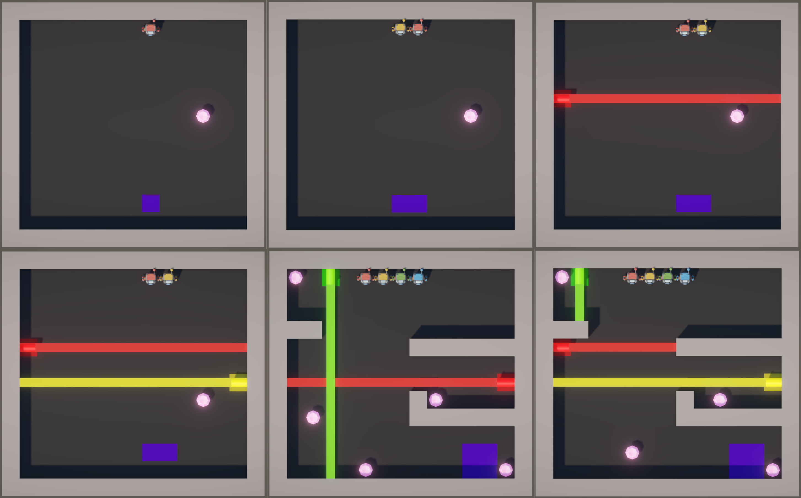

# C-LLE

<p align="center">
  <strong>A cooperative multi-agent reinforcement learning environment built with Unity ML-Agents.</strong>
</p>

<p align="center">
  
  
  
  
</p>


<p align="center">
  
</p>

This repository contains:

- a **base environment** with task rewards
- a **reward-shaped environment** with additional progress and coordination signals
- 6 maps (reproducing the LLE maps 1:1)
- Windows standalone builds
- an example of Python launcher for training with Unity ML-Agents

## Overview

**C-LLE** (Continuous-LLE) is a Unity-based cooperative multi-agent reinforcement learning environment developed for my master's thesis. The environment is designed to study coordination in tasks where multiple agents must navigate shared levels, collect optional shared-reward objects, handle color-dependent hazards, and reach a common exit. It is a continuous counterpart of the [Laser Learning Environment](https://github.com/yamoling/lle), developed to study the MARL techniques with continuous action spaces.


To my knowledge, there is no other continuous environment explicitly developed for training and introducing **State-Space Bottlenecks** with **Zero-Incentive Dynamics**:

- A **SSB** is a state, transition, or restricted region of the state space that
must be reached or crossed in order to access a larger part of the environment or progress
toward the final objective. In cooperative MARL, such bottlenecks are especially difficult
because the action required to open the bottleneck may be performed by one agent, while the
benefit is received by another.
- **ZID** occur when a necessary subgoal or cooperative action is not
directly rewarded by the environment. In this situation, the behavior required for long-term
success does not provide an immediate learning signal. As a result, standard reinforcement
learning algorithms may fail to assign value to the action, even if it is essential for solving the
task.

The combination of SSBs and ZID is particularly challenging because it creates a mismatch
between what is necessary for task completion and what is rewarded during learning. This
explains why an environment may require perfect coordination while still providing weak or
misleading incentives for discovering the correct cooperative behavior.


## Core task

An episode combines navigation, collective progress, and color-dependent coordination.

1. Agents spawn at predefined locations.
2. They navigate a level using continuous two-dimensional movement.
3. Gems may be collected for an additional reward shared by all agents.
4. Colored laser barriers must be handled by the appropriate agent.
5. Each agent receives a shared reward the first time it enters the exit.
6. The team wins when **all agents are simultaneously inside the exit area**.
7. The episode ends on a win, a team death, or a timeout.

Collecting every gem is **not enforced as a formal win condition by the episode manager**. Gems provide additional shared reward and may nevertheless be important to the intended route or experimental objective of a map.

## Environment mechanics

### Agents

The environment uses four agent identities. Each agent receives a one-hot encoding of its identity as part of its observation.

| Color | `playerIndex` | Unity tag |
|---|---:|---|
| Blue | 0 | `PlayerBlue` |
| Yellow | 1 | `PlayerYellow` |
| Red | 2 | `PlayerRed` |
| Green | 3 | `PlayerGreen` |


### Gems

Gems are trigger-based collectibles. When any agent collects a gem:

- every agent receives the configured `gemReward`
- the gem is deactivated for the remainder of the episode
- all gems are restored when the environment resets

The default shared gem reward is `+1.0`.


### SSBs / colored lasers

C-LLE includes Red, Green, and Yellow lasers:

- the agent whose color matches the laser can safely intercept the beam
- a non-matching agent hit by the beam causes a team death
- the laser ray stops at the first collider, so the matching agent can act as a blocker allowing teammates to reach the next area


In the base environment, safe blocking does not add a dedicated reward (ZID). In the shaped environment, the matching agent receives a one-time blocking reward for that barrier during the episode.


<p align="center">
  
</p>


### Exit

The exit tracks which agents are currently inside its trigger. The first time an individual agent enters the exit during an episode, the configured `exitEnterReward` is given to all agents. The episode is won only when every agent is on the exit at the same time.

By default:

- shared reward per agent's first exit entry: `+1.0`
- shared reward when the full team is on the exit: `+1.0`

### Episode failure and timeout

A lethal laser interaction triggers a team death:

- every agent receives `-1.0`
- the episode ends
- agents, gems, exit state, zones, and lasers are reset

Episodes are interrupted when `maxSteps` is reached. Its default value is `15000`. No extra timeout penalty is configured by default.

## Base and shaped version

The repository includes two separate Unity projects.

| Feature | `C-LLE/` | `C-LLE Shaped/` |
|---|---:|---:|
| Shared gem reward | Yes | Yes |
| Shared exit-entry reward | Yes | Yes |
| Shared win reward | Yes | Yes |
| Team death penalty | Yes | Yes |
| Progress zones | No | Yes |
| Zone-visit observations | No | Yes |
| Zone rewards | No | Yes |
| Dedicated SSB blocking reward | No | Yes |

The shaped environment adds two main learning signals:

- **Blocking reward:** `+0.5` to the matching agent the first time it safely blocks its laser during an episode.
- **Zone reward:** `zoneReward × (zoneIndex + 1)` to an agent the first time it enters a progress zone. With the default `zoneReward = 0.3`, zone indices `0`, `1`, and `2` yield `+0.3`, `+0.6`, and `+0.9`.


## Action space

Each agent uses two continuous actions:

| Action | Range | Meaning |
|---|---:|---|
| `a[0]` | `[-1, 1]` | Horizontal movement: left/right |
| `a[1]` | `[-1, 1]` | Vertical movement: down/up |

The action is remapped to the Unity world plane and normalized when its magnitude exceeds `1`.

Actions are held for multiple physics steps through `actionRepeat = 14`. This mimic the movement from LLE, and allows fair comparison between both environments.


## Levels

The project includes six scenes:

- `Map1`
- `Map2`
- `Map3`
- `Map4`
- `Map5`
- `Map6`

The `Launcher` scene loads a selected map from a command-line argument. When no valid map is supplied, the launcher falls back to `Map6`which is the default studied map. The complexity of levels increase, the last one being the hardest to solve.

Accepted forms include:

```text
--map=Map3
--map=3
```

<p align="center">
  
</p>


## Versions

### Unity

- Unity Editor `6000.3.9f1`
- Unity ML-Agents package `4.0.2`
- Universal Render Pipeline `17.3.0`

Using the exact Unity Editor version is recommended for reproducibility.


## Training with Python

The `marl/ppo.py` script given as an example does the follow:

- writes a temporary `train_marl.yaml`;
- launches `mlagents-learn`;
- uses behavior name `LabPlayer`;
- selects a map through `--env-args`;
- supports new and resumed runs;
- supports parallel environment instances;
- runs headless unless `--graphics` is supplied.

Run all commands from the `marl/` directory.

### Train the base environment

```bash
python ppo.py train "../C-LLE/Build/CLLE.exe" 4 30 Map6 5005
```
Where 4 indicated the number of parallel environments (1 is a single environment), 30 is the time scale, Map6 is the last level, and 5005 is the port used to train allowing multiple parallel trainings with different configurations as long as the ports are differents.


### Resume a run

```bash
python ppo.py resume "../C-LLE/Build/CLLE.exe" 4 30 Map6 5005
```

### Show the game window


```bash
python ppo.py train "../C-LLE/Build/CLLE.exe" 4 30 Map6 5005 --graphics
```

## Configuration
These configurations have been found as optimal after doing some hyperparameter optimization. [Optuna](https://optuna.org/) was used to do the search.

<table>
<tr>
<td valign="top">

<h3>PPO / POCA</h3>

<table>
<tr><th>Parameter</th><th>Value</th></tr>
<tr><td>Trainer</td><td>PPO / POCA</td></tr>
<tr><td>Batch size</td><td><code>256</code></td></tr>
<tr><td>Buffer size</td><td><code>2048</code></td></tr>
<tr><td>Learning rate</td><td><code>0.0016305687</code></td></tr>
<tr><td>Beta</td><td><code>0.0008620446</code></td></tr>
<tr><td>Epsilon</td><td><code>0.1366809020</code></td></tr>
<tr><td>Lambda</td><td><code>0.9273810187</code></td></tr>
<tr><td>Epochs</td><td><code>5</code></td></tr>
<tr><td>Hidden units</td><td><code>128</code></td></tr>
<tr><td>Hidden layers</td><td><code>2</code></td></tr>
<tr><td>Observation normalization</td><td>enabled</td></tr>
<tr><td>Discount factor (<code>gamma</code>)</td><td><code>0.99</code></td></tr>
<tr><td>Time horizon</td><td><code>256</code></td></tr>
</table>

</td>
<td valign="top">

<h3>SAC</h3>

<table>
<tr><th>Parameter</th><th>Value</th></tr>
<tr><td>Trainer</td><td>SAC</td></tr>
<tr><td>Batch size</td><td><code>512</code></td></tr>
<tr><td>Buffer size</td><td><code>100,000</code></td></tr>
<tr><td>Learning rate</td><td><code>0.0002</code></td></tr>
<tr><td>Learning rate schedule</td><td>constant</td></tr>
<tr><td>Buffer initialization steps</td><td><code>0</code></td></tr>
<tr><td>Soft update coefficient (<code>tau</code>)</td><td><code>0.007</code></td></tr>
<tr><td>Steps per update</td><td><code>5</code></td></tr>
<tr><td>Initial entropy coefficient</td><td><code>0.48</code></td></tr>
<tr><td>Reward signal steps per update</td><td><code>5</code></td></tr>
<tr><td>Hidden units</td><td><code>128</code></td></tr>
<tr><td>Hidden layers</td><td><code>2</code></td></tr>
<tr><td>Observation normalization</td><td>enabled</td></tr>
<tr><td>Discount factor (<code>gamma</code>)</td><td><code>0.99</code></td></tr>
<tr><td>Extrinsic reward strength</td><td><code>1.0</code></td></tr>
<tr><td>Time horizon</td><td><code>128</code></td></tr>
</table>

</td>
</tr>
</table>

## Monitoring training

ML-Agents writes summaries and checkpoints to its results directory.

To inspect training metrics with TensorBoard:

```bash
tensorboard --logdir results
```


## Extending the environment

### Add a new map

1. Duplicate an existing map scene
2. Update the level geometry and spawn locations
3. Assign all agents, gems, exit components, and lasers
4. Add the scene to Build Settings after the existing maps.
5. Extend the valid scene list in `MapLauncher.cs`.
6. Verify that the `--map` argument loads the new scene.
7. Check that gem and zone counts match the observation settings.

### Change rewards / parameters

Modify the public fields on `CoopEpisodeManager` in the Unity Inspector:

```text
gemReward
winReward
stepPenalty
maxSteps
...
```

## Contact

For questions about the environment, experiments, or thesis, feel free to contact me anytime.